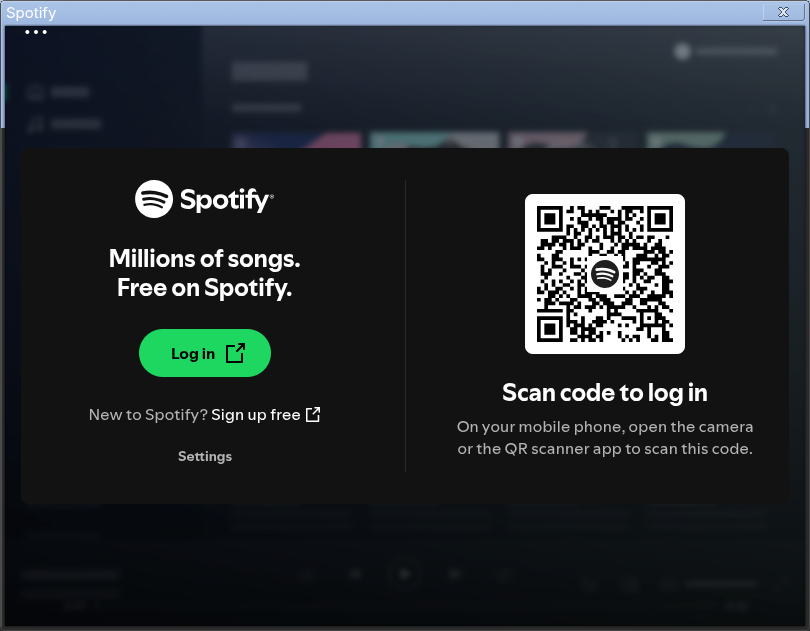

Una solución rapidita, pero que frustra a muchos. Si instalaste Spotify vía Flatpak (`com.spotify.Client`) y te apareció con una barra de título en azul sólido —al mas puro estilo Windows XP, como la que usaba Chrome en sus incios—, en vez del color que le corresponde, no eres el único. Es un bug conocido de los builds de Electron/Chromium, que no manejan bien el *theming* de la barra de título (Window Controls Overlay) cuando corren de forma nativa sobre Wayland.



La solución de siempre es forzar a la app a correr sobre X11. El detalle es que Fedora 44 / GNOME 50 ya no traen una sesión Xorg completa, así que "usa X11" suena más complicado de lo que en realidad es.

**No hace falta instalar X11.** XWayland —la capa de compatibilidad que deja correr apps de X11 dentro de una sesión Wayland— sigue instalada por defecto; Fedora la mantiene justo para casos como este. Solo hay que decirle al sandbox de Flatpak que la use.

## La causa real

Por defecto, el sandbox de Spotify pide el permiso de socket `fallback-x11`, que **solo** monta el socket de X11 dentro del sandbox si NO hay Wayland disponible. Como sí hay Wayland corriendo, ese socket nunca le llega a la app —así que aunque le digas que corra en modo X11, va a intentar conectarse a un display que no tiene, entrará en pánico y va a *crashear* al arrancar.

Hace falta cambiar ese permiso a `x11` (sin el *fallback*) para que el socket esté siempre disponible, y además decirle a Electron que use el backend de X11 en lugar del de Wayland nativo. Son dos cosas distintas, y hace falta hacer las dos o nomás no va a jalar la cosa.

## La solución

Dos comandos de `flatpak override`, sin tocar nada del sistema ni instalar nada extra:

```bash
# 1. Habilitar el socket X11 real (no solo fallback)
flatpak override --user --socket=x11 com.spotify.Client

# 2. Forzar a Electron/GTK a usar el backend X11 (corre vía XWayland)
flatpak override --user --env=ELECTRON_OZONE_PLATFORM_HINT=x11 com.spotify.Client
flatpak override --user --env=GDK_BACKEND=x11 com.spotify.Client
```

Después, hay que cerrar Spotify por completo y volver a abrirlo, no basta con solo cerrar la ventana:

```bash
flatpak kill com.spotify.Client
flatpak run com.spotify.Client
```

## Verificar que quedó bien

```bash
flatpak override --user --show com.spotify.Client
```

Debería mostrar algo así:

```
[Context]
sockets=x11;
[Environment]
ELECTRON_OZONE_PLATFORM_HINT=x11
GDK_BACKEND=x11
```

Y si revisas los procesos de Spotify, deberían listar `--ozone-platform=x11` en lugar de `--ozone-platform=wayland`:

```bash
ps aux | grep "extra/share/spotify/spotify" | grep -o "\-\-ozone-platform=[a-z0-9]*" | sort -u
```

Y claro, la muestra mas obvia es que el cliente de Spotify ya debería verse algo así:


## Cómo revertirlo

Si en algún momento quieres volver al comportamiento nativo de Wayland —por ejemplo, si una futura versión de Spotify arregla el bug por su cuenta *(lo cual dudo porque este bug ya lleva rato y a Spotify le vale 3 kilometros de ... linux)*—:

```bash
flatpak override --user --reset com.spotify.Client
```

## Por qué no otras variantes que capaz ya intentaste

Antes de llegar a esta combinación, hay caminos que parecen razonables pero no funcionan, y vale la pena dejarlos anotados para que no pierdas el tiempo en ellos:

- **Solo `GDK_BACKEND=x11`, sin nada más.** No alcanza. Spotify es una app de Electron/Chromium, no de GTK puro —esa variable no controla su backend de renderizado.
- **Solo `ELECTRON_OZONE_PLATFORM_HINT=x11`, sin el socket de X11.** La app arranca, pero se queda en Wayland nativo de todos modos: el *hint* no fuerza nada por sí solo si no hay un display de X11 accesible dentro del sandbox. La barra sigue mal.
- **Pasar `--ozone-platform=x11` como flag directo**, por ejemplo editando `~/.var/app/com.spotify.Client/config/spotify-flags.conf`. Con el socket todavía en `fallback-x11`, esto hace que la app se caiga al arrancar (exit 1, ni ventana aparece), porque intenta conectarse a un display de X11 que no existe dentro del sandbox. No hace falta si ya aplicaste el override del socket más las dos variables de entorno de arriba.

Resultó melindroso el ***spotiflais***...

## Si no quieres batallar hay alternativas...

En Flatpack puedes encontrar **Riff**, un cliente spotify —obviamente no oficial— pensado para GNOME, eso sí, necesitas obligatoriamente una cuenta premium y de vez en cuando (bastante rara la ocasión) puede tener problemas de reproducción que suelen resolver con una actualización bastante rápido.

O siempre puedes usar el cliente web, digo...