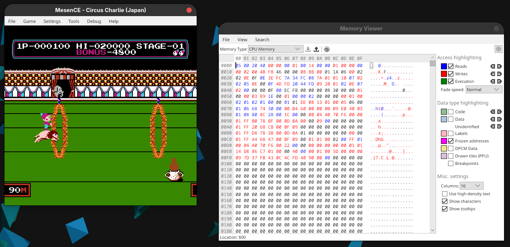
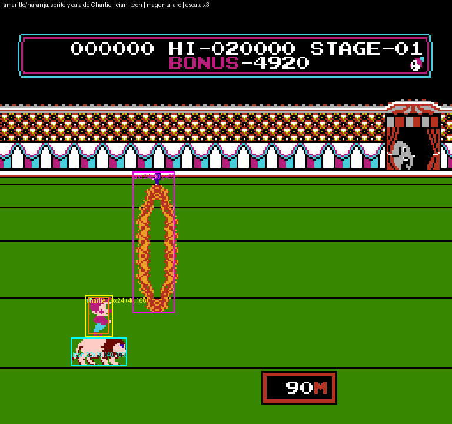
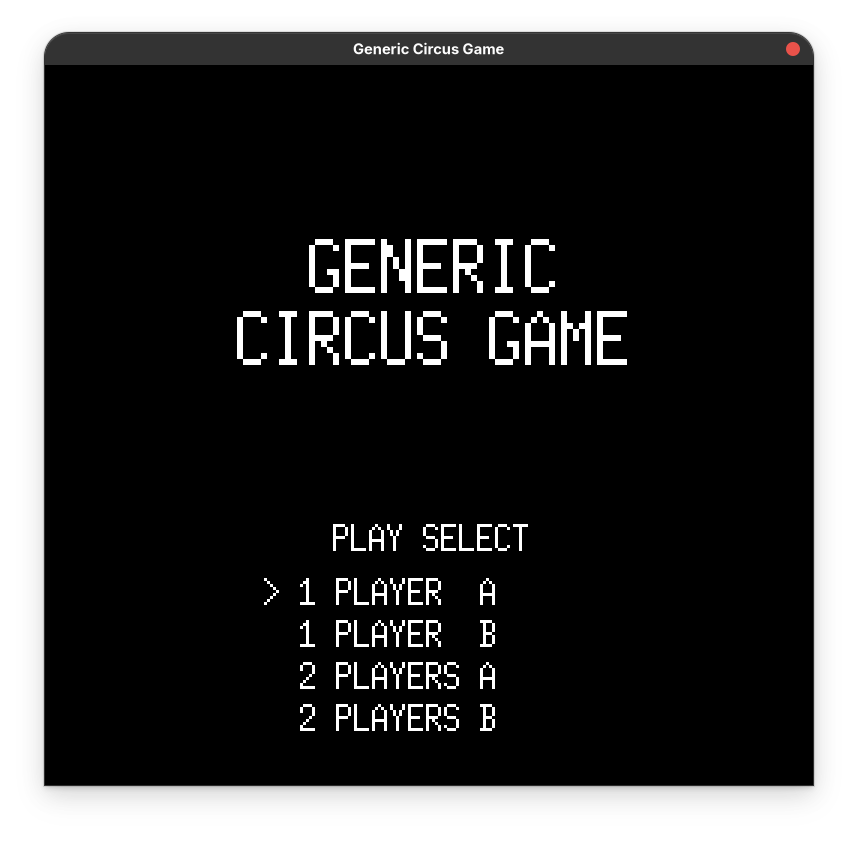
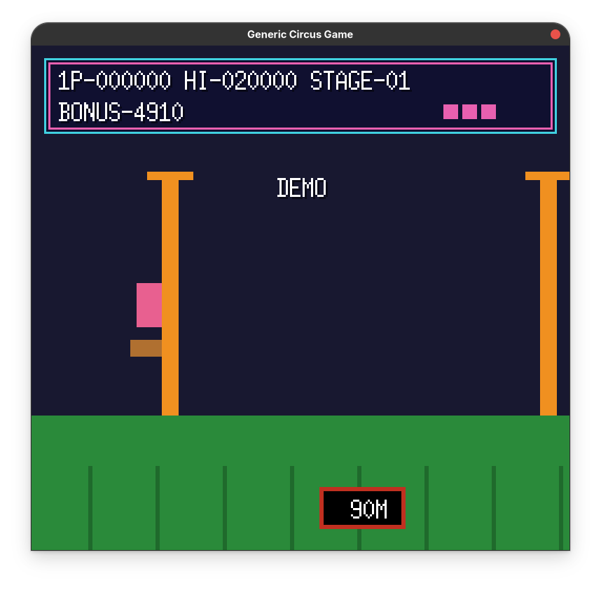

Hay un juego de 1984 en el que un payaso salta aros de fuego montado sobre un león, quizá lo hayan jugado y lo recuerden: **Circus Charlie**. Lo jugué hasta el cansancio de niño, e incluso aún lo juego ocasionalmente... y todo comenzó, como casi todo lo que hago, por pura curiosidad. Ya saben cómo es esto por aquí: empiezo preguntándome algo inocente, y tres meses después tengo un desensamblador recursivo escrito en Python y una hoja de cálculo con las coordenadas de colisión de un león de 8 bits.

No voy a negar que siempre he tenido ganas de programar un juego. Hace muchos años hice uno sencillo con Unity y poco después traté de recrear otro en Godot. Con el tiempo lo fui dejando de lado —tan de lado como terminé dejando Rust por Go en justwrite, para que vean que lo de abandonar cosas a medio camino es tradición en esta casa—. Pero en los últimos años ha crecido una comunidad que *recompila* juegos de N64 y PlayStation: toman el juego, entienden su código y lo portan a PC u otras consolas, sin emulador de por medio. Y yo me hice la pregunta: ¿por qué no se hace lo mismo con NES? Recreaciones hay muchas, pero ports como tal, casi ninguno. Y, claro, me hice **la maldita pregunta**: ¿qué tan difícil puede ser? Después de todo, NES debe ser más sencillo... ¿no?

Sinceramente habría sido más sencillo irme caminando de Alaska a la Patagonia, estoy 100% seguro de que al menos me habría dado menos dolores de cabeza.

Mi idea original era hacer un port que no emulara ni replicara la arquitectura del NES. Pero el panorama legal de este tipo de proyectos es gris, de esos donde nada es seguro, así que cambié de estrategia: en vez de portar el código, **desensamblarlo para comprender cómo funciona**, analizar la memoria para tener datos certeros (cuánto dura la pantalla de título, en qué momento arranca la demo, qué tan alto salta Charlie), y con base en esas mediciones y en lo que aprendí del código, hacer un juego similar en Go con [Ebitengine](https://ebitengine.org/). Habrá diferencias, claro, porque no traduzco el código literalmente: es **mi reinterpretación** a partir del análisis y las mediciones.

Y antes de reinterpretar nada hay un problema: **nadie te explica nada, ni tienen por qué hacerlo**. No hay código fuente, no hay nombres de variables, no hay documentación, ni siquiera un mapa público de la memoria de esta versión. Todo lo que tienes es un archivo de 16 KB y mucha paciencia.

Circus Charlie es de Konami (arcade, 1984), pero preferí trabajar con la versión de Famicom que hizo Soft Pro en 1986 (consideré que era más sencillo que el juego de arcade... aunque voy a extrañar el nivel de los trampolines). Mi proyecto se llama **Generic Circus Game**, no pienso distribuir nada del original (guiño, guiño), el repositorio es privado, y los gráficos y la música serán propios (versiones mías de las obras originales que usa el juego, que afortunadamente ya son de dominio público). El cartucho es mi libro de consulta, comparo contra él cada detalle.

## El cartucho y sus límites

Vamos a ver contra qué nos estamos enfrentando: es un cartucho de Famicom tipo NROM —el "modelo base" de cartucho; es algo así como la versión sin aguacate de los cartuchos de NES—, o sea, el más simple que existe, sin ningún chip extra. Trae 16 KB de programa (que es básicamente la receta completa del juego) y 8 KB de gráficos fijos (los dibujitos, ya listos, que la consola solo tiene que acomodar en pantalla). La CPU es un 6502 (**dato nerdo**: en realidad es una variante, la 2A03, pero para lo que nos preocupa son casi lo *mesmo*) a unos 1,79 MHz. El vídeo se refresca 60,1 veces por segundo (o sea que dibuja una imagen nueva sesenta veces cada segundo). Y con apenas **2 KB de RAM** para todo el juego (la servilleta manchada de café donde el juego anota todo lo que va pasando: dónde está Charlie, cuántos puntos llevas, todo).

Deténganse un segundo en ese número: 2 KB. Todo —posición de Charlie, del león, de cada aro, cada chango, la puntuación, las vidas, el estado del juego completo— vive en un espacio más chico que el tamaño de este párrafo en texto plano. Si [ya me quejé anteriormente que pa'todo quieren meterle IA a las cosas](/posts/el-software-moderno-y-la-crisis-de-la-optimizacion-cuando-meter-ia-en-el-cereal-se-volvio-normal/), esto es el otro extremo del espectro: un juego completo, con física, colisiones y puntuación, cabe en menos espacio del que ocupa el ícono de una aplicación moderna.

Y aquí viene la primera pista importante: **toda la lógica del juego corre dentro de la interrupción de vídeo** —una especie de alarma que la consola hace sonar sesenta veces por segundo para decir "*oye, ya acabé de dibujar, haz lo que tengas que hacer antes de que dibuje otra vez*"—, una vez por cuadro. Cada 1/60 de segundo la consola avisa "terminé de dibujar", y el juego aprovecha ese aviso para leer el control, mover todo, revisar choques y preparar el siguiente cuadro. Eso significa que el juego es, en esencia, una función que se ejecuta una vez por cuadro y que lee y escribe 2 KB de memoria. Si te pones a pensarlo es simplemente impresionante.

*Eso es lo que me gustaba de la programación de antes, tenías que hacer rendir las cosas, no que ahora tienes editores de texto que pesan cientos de megas... Y ocupan otros tantos de RAM.*

## Desensamblar sin perderse

El primer paso es despedazar al paciente, es decir, convertir esos bytes en instrucciones legibles —en otras palabras, **desensamblar**: traducir "lenguaje de máquina", que son solo números, a algo que (se supone) un humano puede leer, como "suma esto" o "ve pa'allá"—, y es menos sencillo de lo que suena. Por ejemplo, este es el comportamiento de la cuenta atrás de los puntos de bonus (que tambien sirven como tiempo para pasar cada etapa). Estos son los primeros 27 bytes de la rutina del bonus:

`A5 0F D0 F4 A5 09 29 0F D0 EE A2 00 DE 41 03 10 0A A9 09 9D 41 03 E8 E0 03 D0 F1`

Eso es todo lo que hay: 27 números, sin separaciones ni nombres. Desensamblar es partirlos en instrucciones y ponerles nombre:

| Bytes | Instrucción | En humano |
|---|---|---|
| `A5 0F` | `lda $0F` | carga en el acumulador el valor guardado en la posición 15 |
| `D0 F4` | `bne (−12)` | si no era cero, salta 12 bytes atrás |
| `A5 09` | `lda $09` | carga el valor de la posición 9 |
| `29 0F` | `and #$0F` | quédate solo con los 4 bits bajos |
| `D0 EE` | `bne (−18)` | si no es cero, salta |
| `A2 00` | `ldx #$00` | pon X a 0 |
| `DE 41 03` | `dec $0341,x` | resta 1 a la posición 0341 + X |
| `10 0A` | `bpl (+10)` | si no quedó negativo, salta 10 bytes adelante |
| `A9 09` | `lda #$09` | carga el número 9 |
| `9D 41 03` | `sta $0341,x` | guárdalo en 0341 + X |
| `E8` | `inx` | suma 1 a X |
| `E0 03` | `cpx #$03` | compara X con 3 |
| `D0 F1` | `bne (−15)` | si no son iguales, vuelve atrás |

Hay tres detalles que tenemos que entender y que explican por qué no es tan sencillo como suena:

- Cada instrucción mide un número distinto de bytes (1, 2 o 3). Para saber dónde empieza la siguiente hay que decodificar la anterior; si te equivocas en un solo byte, todo lo que sigue sale como basura.
- Las direcciones están escritas "al revés": 41 03 significa la posición $0341, con el byte bajo primero. Es una de esas rarezas de la CPU que el desensamblador debe conocer, por eso es tan importante saber sobre qué modelo de CPU corre el código.
- Los saltos no dicen "ve a tal sitio" sino "avanza o retrocede N bytes" (F4 es −12). Para saber a dónde van hay que hacer la cuenta, y de ahí salen las etiquetas.

Otra cosa, nada marca qué es código y qué es dato: esos mismos 27 bytes podrían ser una tabla de números y la CPU no tiene forma de distinguirlos: unos bytes que son una tabla de números se pueden "leer" perfectamente como instrucciones, y el resultado aunque parece razonable realmente no es nada más que pura basura. Un desensamblador lineal, de los que van de principio a fin, se confunde en cuanto topa con la primera tabla.

Esos casos son las **tablas de despacho en línea** —imaginen una receta de cocina donde, a mitad de un paso, en lugar de seguir con el siguiente paso, hay una lista de ingredientes escondida ahí mismo, y si no sabes que es una lista, la sigues leyendo como si fueran más pasos de la receta—: una rutina se llama, y justo detrás de la llamada, pegados al código, vienen los datos que usa. La dirección a la que *regresa* la rutina apunta a esa tabla en lugar de a la siguiente instrucción, así que cualquier desensamblador que peque de ingenuo interpreta como código lo que es una lista de destinos. Es, literalmente, código escrito para confundir a cualquiera que no sea la propia consola —solo que en 1986 a nadie se le ocurrió que alguien, cuarenta años después, se iba a sentar a desenredarlo por puro gusto.

La solución fue escribir un desensamblador **recursivo**, en Python. En vez de leer de corrido, arranca en los puntos de entrada de la consola (reinicio, interrupción de vídeo, interrupción externa) y *sigue el flujo*: si hay un salto, va al destino; si hay una bifurcación, explora las dos ramas; cuando se encuentra una de esas tablas incrustadas, la reconoce y la trata como datos. Todo lo que nunca se alcanza queda marcado como dato.

¿Y cómo sé que no me equivoqué? Con una prueba tan brutal que me encanta (masoquista el muchacho...): el resultado que te entrega el desensamblador lo **vuelves a ensamblar**, y tiene que dar, byte por byte, el mismo programa que el cartucho. Y cómo no, también se hace la comparación con otro script de Python.

```python title="verify.py"
import os, subprocess, sys
import disasm
from rom import parse_prg

HERE = os.path.dirname(os.path.abspath(__file__))
OUT = os.path.join(HERE, "out")
LABELS = os.path.join(HERE, "private", "labels.json")
ENTRIES = os.path.join(HERE, "private", "entries.json")
DISPATCHERS = os.path.join(HERE, "private", "dispatchers.json")


def main(rom):
    asm, obj, binf = (os.path.join(OUT, n) for n in ("prg.asm", "prg.o", "prg.bin"))
    disasm.main([rom, "-o", asm, "--labels", LABELS, "--entries", ENTRIES,
                 "--dispatchers", DISPATCHERS])
    subprocess.run(["ca65", "--cpu", "6502", "-o", obj, asm], check=True)
    subprocess.run(["ld65", "-C", os.path.join(HERE, "link.cfg"), "-o", binf, obj], check=True)
    want, got = parse_prg(open(rom, "rb").read()), open(binf, "rb").read()
    if want == got:
        print("OK")
        return 0
    i = next((k for k in range(min(len(want), len(got))) if want[k] != got[k]), min(len(want), len(got)))
    print(f"DIFF en offset {i:04X} (dir {0xC000 + i:04X})")
    return 1


if __name__ == "__main__":
    sys.exit(main(sys.argv[1]))
```
El proceso es este:

1. Desensamblar: disasm.py lee la parte de programa del ROM (los 16 KB de PRG, sin la cabecera) y genera prg.asm.
2. Reensamblar: ca65 convierte ese .asm otra vez en código objeto y ld65 lo enlaza en un binario prg.bin de 16 KB. Un archivo de enlace (link.cfg) le dice que el programa empieza en $C000, mide $4000 bytes y se rellena con $FF (el relleno típico de un cartucho vacío).
3. Comparar: el script lee el PRG del ROM original y prg.bin, y los compara bytes con bytes. Si son idénticos imprime OK; si no, indica el primer byte que difiere (DIFF en offset ...) para ir directo al fallo

En pocas palabras si me equivoqué en un solo byte —una tabla tomada por código, un salto mal resuelto—, ya no coincide. Cuando por fin imprimió `OK`, supe que el código que tenía era una descripción fiel del programa y no una interpretación optimista. Pocas veces un simple `OK` en una terminal me ha dado tanta satisfacción.

Lo bonito de'tó esto es que demuestra:
- Cada byte del cartucho quedó clasificado como instrucción o como dato (.byte, .word). Si hubiera tomado un dato por código, o al revés, la lista de bytes que genera ensamblar sería distinta y la comparación fallaría.
- Un desensamblador que solo produjera texto bonito podría equivocarse sin que nadie lo notara. Este tiene un veredicto objetivo: o reproduce el cartucho exacto o no.
- No demuestra que hayamos entendido qué hace cada rutina; solo que dividimos bien los bytes y que el .asm es fiel. Entender el significado viene del emulador y de la lectura de la memoria.

Después viene lo más humano: darle nombre a las cosas. Nombres por lo que *hacen*, no por lo que parecen, porque lo segundo cambia cada vez que entiendes un poco más.

## El emulador como microscopio

Con el código desensamblado puedes leer, pero leer ensamblador de 8 bits para entender las reglas de un juego es como entender una película leyendo el guion de una escena suelta —sirve solo si ya conoces el contexto. Y ese contexto solo lo puedes obtener de una forma: **mirar la memoria mientras el juego corre**.



Usé el emulador [Mesen CE](https://github.com/nesdev-org/MesenCE) en modo sin ventana (o sea, sin dibujar nada en pantalla, solo haciendo las cuentas: más rápido, porque no gasta tiempo en pintar algo que nadie va a ver), controlado con scripts en Lua. Un script puede pulsar botones, escribir memoria y, lo más importante, **volcar los 2 KB de RAM completos en cada cuadro** (tomarle una foto a la servilleta de apuntes del juego, sesenta veces por segundo). Corre a unos 550 cuadros por segundo por proceso (el juego real va a 60), es completamente determinista —es decir, la misma entrada produce siempre el mismo resultado, como un robot que nunca se cansa ni se distrae o un burócrata— y puedo lanzar varios procesos en paralelo (mi CPU alcanzó lo 87 °C). Un minuto de juego se mide en una fracción de segundo.

Esto está chido porque **aún sin entender el código, la RAM cuenta la historia**. La técnica es detectivesca, digna de Sherlock Holmes, y se reduce a comparar:

- Pulsas Derecha y ves qué bytes cambian. Uno sube 1 por cuadro mientras avanzas: es la distancia recorrida.
- Hay un byte que cambia entre título, pantalla de etapa, jugando, golpeado y *game over*: es el estado del juego.
- La puntuación son tres bytes en BCD —un truco viejísimo donde, en lugar de guardar el número "normal" en binario, cada mitad de byte guarda un dígito decimal (0 al 9) tal cual, para no tener que hacer cuentas al momento de dibujarlo en pantalla— así que los puntos se leen casi directamente.
- El bonus son cuatro dígitos que bajan de 10 en 10, una vez cada 16 cuadros.
- Las vidas son un contador que baja cuando algo sale mal.

Así, en unas horas, un mapa de memoria que nadie había publicado empieza a existir. Y también aprendí por las malas tres trampas de este método:

**Mirar solo los cambios engaña.** Si registras únicamente cuándo cambia una variable, concluyes cosas falsas, porque te pierdes lo que *no* cambia. Mi primera herramienta anotaba el valor de cada byte únicamente cuando cambiaba, y la tabla resultante era preciosa: una lista corta y limpia. En la primera etapa, Derecha producía 1, 2, 3, 4… y dije: el escenario avanza un píxel por cuadro. Lo que no me dije es que esa lista habría sido idéntica si la variable se hubiera quedado quieta varios cuadros entre cambio y cambio. Lo comprobé después en la etapa de la cuerda: mirando el valor en cada cuadro, el escenario avanza tres cuadros y se detiene uno (0 0 0 1 2 3 3 4 5 6 6 7…), es decir, 0,75 píxeles por cuadro; el registro "solo cambios" de ese mismo experimento sale como 0 1 2 3 4 5… y parece un perfecto 1 por cuadro. En la primera etapa acerté de casualidad, y por eso el defecto tardó en ser claro. Los huecos —lo que no cambia— solo nos dicen una parte, y un registro de cambios los tira a la basura. Hay que mirar el valor en cada cuadro.

**Hay que probar desde estados avanzados.** Las primeras pruebas me decían que la tecla Izquierda "no hacía nada", cosa que no me cuadraba con mi experiencia en el juego. Resulta que el script solo la probaba al empezar el escenario, donde ya está en su tope y no se puede retroceder; en cuanto avanzas, claramente Izquierda sí funciona. Un comportamiento que parece ausente puede ser solo un caso límite. (Y sí, me tardé en darme cuenta de esto más de lo que estoy dispuesto a admitir.)

**Las herramientas tienen sus propias trampas.** La salida del emulador solo aparece cuando el proceso termina, y el modo sin ventana corta tu script a los 100 segundos si no le indicas otro límite. Más de una vez me quedé mirando una terminal vacía preguntándome qué había hecho mal, con esa sensación tan conocida de "seguro es mi código" que casi siempre resulta ser la herramienta.

## Tres historias de descubrimiento

Debo aclarar, que al momento de escribir esto, solo he avanzado en la primera de cinco etapas que tiene el juego: la del león —la primera para ser exactos—. Así que aún queda mucho por descubrir, ¿no les emociona?

### La colisión: rectángulos, y un detalle de 2 píxeles

Para saber cómo decide el juego que chocaste, enganché la rutina que compara posiciones y leí los valores que carga justo antes. La respuesta fue muy poco glamorosa y por eso —*chef kiss*— hermosa: **todo son rectángulos**. La regla es un cruce de intervalos en cada eje —en otras palabras: le pone a cada cosa una caja invisible, y si dos cajas se traslapan, hay choque, ni más ni menos—, con los bordes incluidos. Charlie, bueno, su caja de colisiones mide 21×12 píxeles, el león 8×22, la olla de fuego 28×10. No hay formas complejas, no hay nada de píxeles perfectos. Toda la magia de "sentir" que el salto fue justo o injusto sale de cuatro números por objeto.



Pero lo chido vino al comparar con el juego real, porque la teoría y la práctica no coincidían. Los aros, según el propio juego, tienen su punto de choque a cierta altura; sin embargo, midiendo 121 saltos, los golpes reales ocurrían como si ese punto estuviera **2 píxeles más arriba** de lo que el juego informa (con razón de niño siempre sentía que el león se quemaba la panza). Y mi hipótesis inicial era peor: pensaba que cada aro tenía *dos* puntos de choque. Es uno solo, y no estaba donde yo creía. Ya iban dos hipótesis mías que el propio cartucho se encargó de humillar.

### Los puntos: la suma, no el obstáculo

Pensaba que los puntos dependían de qué obstáculo habías saltado: tanto por un aro, tanto por una olla. Los datos dijeron otra cosa. Para empezar los puntos **se conceden al aterrizar**, o sea que si saltaste un aro pero caes en una olla no ganas nada. Y dependen de la *suma* de lo que superaste durante ese salto: cada aro cuenta 1, cada olla cuenta 2, y esa suma se convierte en puntos mediante una tabla (100, 200, 400, 500, 800, 1000 y hasta 5000 si no riegas las paletas). Saltar dos aros de un golpe vale más que dos saltos de un aro, y no hay forma de saberlo sin medir partidas completas.

Con eso salieron también otras reglas pequeñas: se gana una vida a los 20,000 puntos y luego cada 40,000, el bonus de 5,000 baja 10 cada 16 cuadros, y si llega a cero, Charlie muere. Un reloj implacable que nadie en 1986 se molestó en explicar.

### La victoria: no es lo que parece

La tercera es mi favorita. Creía que ganabas la etapa al *aterrizar* sobre el pedestal del final, o que existía una ventana de posición y de cuadro en la que, si estabas ahí, ganabas. No lo voy a negar, estaba más perdido que niño en centro comercial en navidad.

La victoria **es una colisión como cualquier otra**: la caja del león roza con un solo píxel la del pedestal, en pleno salto, mientras casi toda la figura sigue encima de la olla de fuego. Por eso el juego te da por ganador cuando "parece" que vas a estrellarte contra la olla: ya ganaste, solo que la imagen aún no te alcanza para enterarte. Es de esas reglas que ningún jugador sabe formular, pero que todos sentimos cuando las cosas "salen" —y que a mí me tomó tres hipótesis fallidas y bastante terquedad entender.

## Aritmética de 8 bits y el tiempo

Algo que hay que tener presente: **no hay coma flotante** —es decir, no existen los números con punto decimal, como 0.75 o 3.14; para esta consola solo existen los números enteros—. Todo es entero, siempre. Las velocidades fraccionarias, como 0,75 píxeles por cuadro, se implementan con acumuladores: cada cuadro se suma una fracción (cuartos de píxel) y cuando el acumulador desborda —se les va llenando un vasito invisible de "cuartos de píxel" y, cuando se derrama, ese derrame cuenta como "avancé un píxel entero"—, el objeto avanza un píxel entero. Parece un truco, y lo es, pero es la única forma de mover algo "a tres cuartos de píxel por cuadro" cuando el hardware solo sabe de números enteros. Nada de `float`, nada de redondeos convenientes: pura aritmética de carry (la técnica de "llevarse uno" que nos enseñaron de niños para sumar), la misma que aprendí en la primaria sin saber que algún día me iba a servir para entender a un payaso virtual.

Con esto sale todo lo demás. El salto mide 57 píxeles de altura y dura 68 cuadros, y **la dirección queda fijada al despegar**: puedes soltar Derecha en el aire y no pasa nada, la trayectoria ya está decidida. Los aros no solo se acercan porque el escenario avanza, sino que además tienen un movimiento propio de unos 0,379 píxeles por cuadro, con un reloj compartido por todos los aros, y sus sprites se colocan de 2 en 2 píxeles. Esa combinación hace que el momento exacto en que aparece el siguiente aro (cuando el anterior baja de un umbral que sale de una tabla ligada a la dificultad) solo pude reproducirlo con una tolerancia de ±1 cuadro.

Y la animación de carrera, que parecía lo más trivial, resultó un pequeño contador de 8 cuadros que avanza solo cuando Charlie corre en el suelo, **se congela en el aire** y nunca se reinicia. Yo creía que se reiniciaba al aterrizar. No lo hace. Otra hipótesis más para la lista de bajas.

## Mirar el vídeo, no solo la CPU

La CPU cuenta qué hace el juego, pero hay otro chip que cuenta qué *se ve*: el de vídeo (el que de verdad pinta los pixeles en la pantalla; la CPU solo le da órdenes, como un director que nunca toca la cámara). Leyendo su memoria de sprites —que son como calcomanías que se pueden mover libremente sobre el fondo, a diferencia del fondo mismo, que está pegado y se mueve todo junto— (64 sprites, cada uno con posición, mosaico, paleta y volteo), las paletas y los mosaicos gráficos del cartucho, se puede reconstruir qué se dibuja y cuándo.

Eso reveló que muchas cosas que uno asume como sprites **no lo son**: la olla con su llama, los carteles de distancia, el pedestal, el público y las carpas del fondo son parte del *fondo* (mosaicos del escenario, pegados entre sí como un mural que no se puede mover pieza por pieza), y por eso aparecen y se desplazan junto con él. En cambio, Charlie y el león sí son sprites (calcomanías que sí se pueden mover de forma independiente), armados como composiciones de 6 y 8 mosaicos de 8×8 píxeles, cada una con sus propias reglas de animación (¿sabían que solo hay 5 sprites de Charlie? dos para el movimiento, uno para cuando "muere" y otros dos para celebrar). Saber esto cambia cómo hay que programar el juego propio: algunas cosas son personajes, otras son escenografía, y confundir unas con otras te lleva por un camino de arquitectura completamente equivocado.

## Lo que se resiste

Sería deshonesto presentar esto como un trabajo cerrado. Hay cosas que todavía no cuadran:

- La tabla que define cuándo aparece cada aro la validé a fondo para la primera dificultad, pero en las otras tres solo funciona al arranque: los umbrales altos no se cumplen como los leí del código.
- Hay un golpe suelto que ocurre unos 4 cuadros antes de lo esperado, y todavía no sé por qué.
- No tengo claro si retroceder con Izquierda anima a media velocidad *fuera* de la zona final (donde sí lo medí), o si solo es mi percepción.
- La actualización del récord no la pude observar (en memoria).
- Y como ya aclaré antes faltan por descifrar enteras las etapas de los monos, las pelotas, el caballo y el trapecio.

Cada una de estas es, en el fondo, otra hipótesis esperando que el juego la contradiga. A estas alturas ya hasta le agarré cariño a que me desmientan.

## Entonces, ¿qué estoy construyendo?

No es un emulador. Un emulador reproduciría la CPU, el chip de vídeo y la memoria de la consola. Y tampoco una traducción del ensamblador a Go (eso sería directamente violar derechos de autor), yo prefiero tomar lo que *hace* el juego y reescribirlo como un programa normal en Go + Ebitengine, **sin nada del hardware del NES**: ni CPU, ni memoria de vídeo, ni interrupciones. La lógica del juego es una simulación limpia que no sabe que alguna vez corrió en un cartucho.

<div class="flex gap-4">





</div>

A la fecha, la primera etapa está casi completa: obstáculos, colisiones, puntuación, vidas, bonus, pantallas, pausa, dos jugadores, algunos sonidos sintetizados, y cada comportamiento está comprobado cuadro a cuadro contra el original con pruebas automáticas. Falta trabajar en los gráficos, animaciones, y claro, la música; pero ahí le vamos *juimos* dando... Todavía queda un camino largo, pero ya sé algo que antes no sabía: que descifrar un juego es, casi siempre, descubrir que tus hipótesis sobre cómo funcionan las cosas suelen ser más elegantes que la solución implementada en realidad. Y que un cartucho de 16 KB, puede resultar mucho más complejo que muchos programas actuales de cientos de megas.