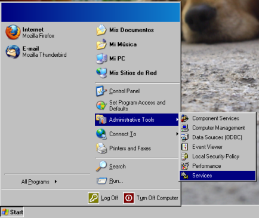
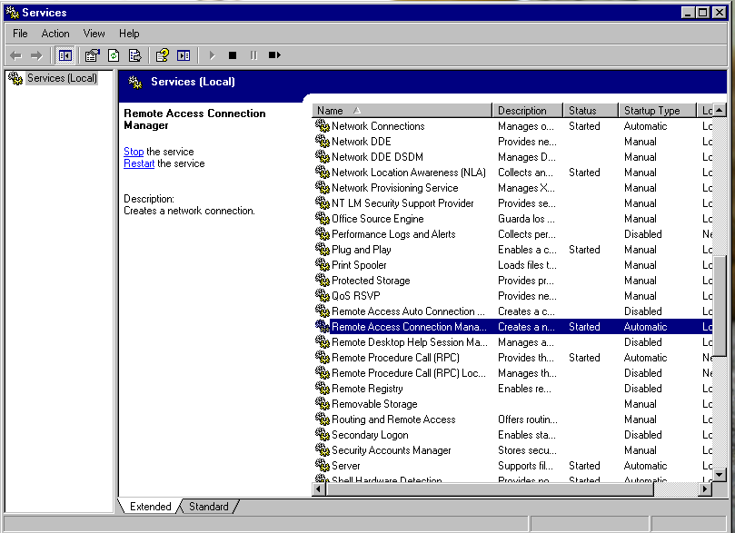
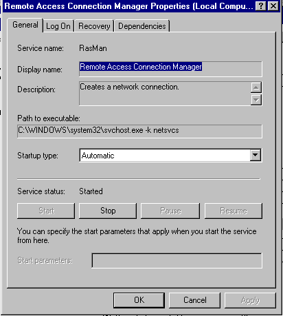
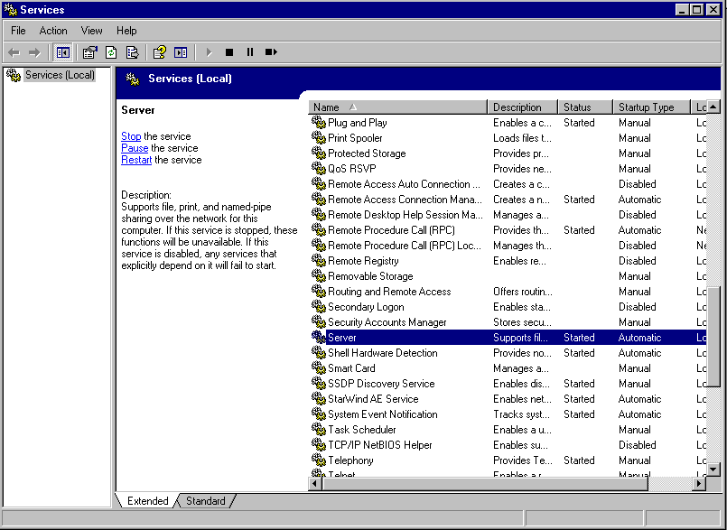
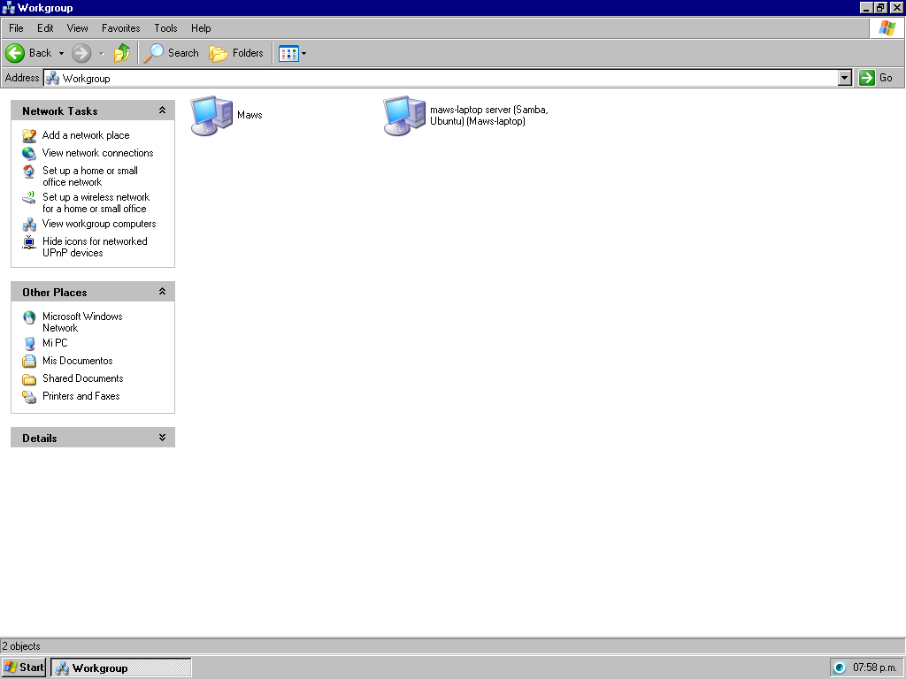
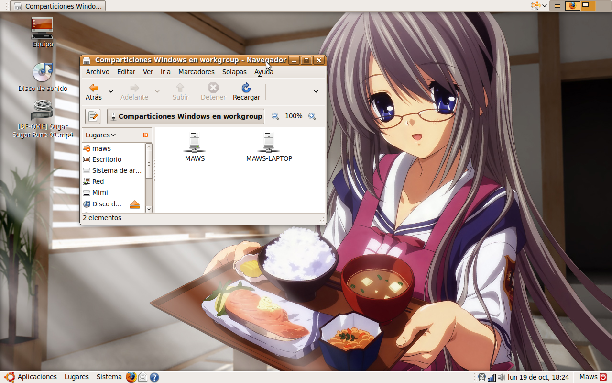

Uno de los problemas más comunes usando el Windows de SuricataOS (y Mangosta Edition) es compartir carpetas, archivos e impresoras a través de una red; sin embargo, este problema es mucho más sencillo de resolver de lo que parece. Así que trataré de explicarlo de la forma más sencilla posible para que ~~hasta un mono amaestrado~~ cualquiera pueda compartir impresoras y archivos en red utilizando SuricataOS.

Mi versión de SuricataOS está en inglés, por lo cual las imágenes aparecerán en ese idioma; sin embargo, las instrucciones las daré como aparecerían en una versión en español, aunque los nombres podrían variar.

## Activar el Administrador de conexiones de acceso remoto

Lo primero que tenemos que hacer es abrir la opción **Servicios** en **Herramientas Administrativas** (la misma que ocupamos para activar el acceso a internet). Para esto tenemos dos formas de hacerlo: la primera es ir a *Inicio / Panel de Control / Herramientas Administrativas / Servicios*, y la segunda forma —y, a mi parecer, la más rápida— es una opción que nos brinda el mismo SuricataOS, la cual consiste en ir al menú *Inicio / Herramientas Administrativas / Servicios*.

Una vez que hemos abierto la ventana de Servicios, buscaremos la opción **Administrar Conexiones de Acceso Remoto** (*Remote Access Connection Manager*), damos clic con el botón secundario del mouse y abrimos el cuadro de **Propiedades**.

Una vez abierto el cuadro de Propiedades, en la pestaña **General** buscamos las opciones **Tipo de arranque** (*Startup type*) y **Estado del servicio** (*Service status*), que por *default* nos aparecerán como *Desactivado* (*Disabled*) o en *Manual* y *Detenido* (*Stopped*), respectivamente. El **Tipo de arranque** lo cambiaremos por **Automático** y daremos clic en **Aplicar** (*Apply*); esto activará el botón **Comenzar** (*Start*) en la parte que dice *Estado del servicio*. Damos clic en **Comenzar**, rectificamos que el estado haya cambiado a *Iniciado* (*Started*) y damos clic en **Aceptar** (*OK*), quedando de la siguiente forma:

## Activar el Servidor

Ahora buscaremos en la ventana de Servicios (*Services*) la opción **Servidor** (*Server*) y repetimos los mismos pasos: cambiar el **Tipo de arranque** a **Automático** y cambiar el **Estado del servicio** a **Iniciado**.

## Activar la Estación de Trabajo

Y, por último, hacemos lo mismo con la opción **Estación de Trabajo** (*Workstation*).

## La prueba de fuego

Después de haber hecho estas simples configuraciones, realizaremos la **prueba de fuego** para verificar que efectivamente ahora podemos compartir archivos e impresoras a través de una red. Lo más simple es abrir **Mis sitios de Red** y ver los equipos del grupo de trabajo: si nos muestra nuestra PC y los demás equipos de la red, es prueba de que configuramos satisfactoriamente nuestro acceso remoto.

Otra forma —muy recomendada— de comprobarlo es compartir una carpeta y acceder a ella desde otra PC de la red. En este caso, hago la prueba en dos máquinas: una con SuricataOS y otra con Linux Ubuntu.

