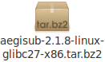
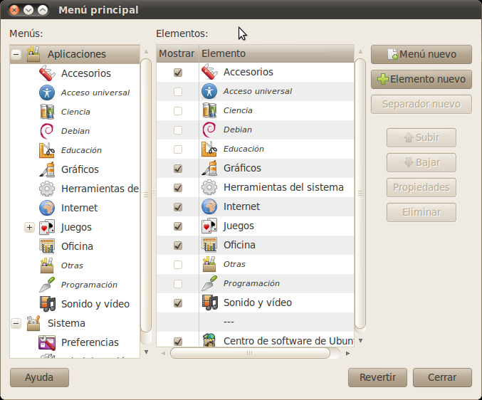
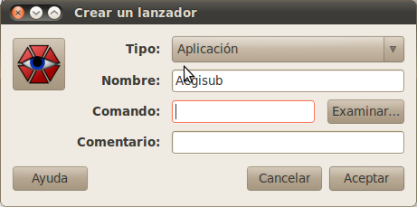
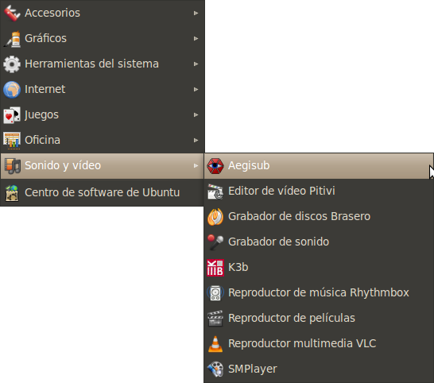
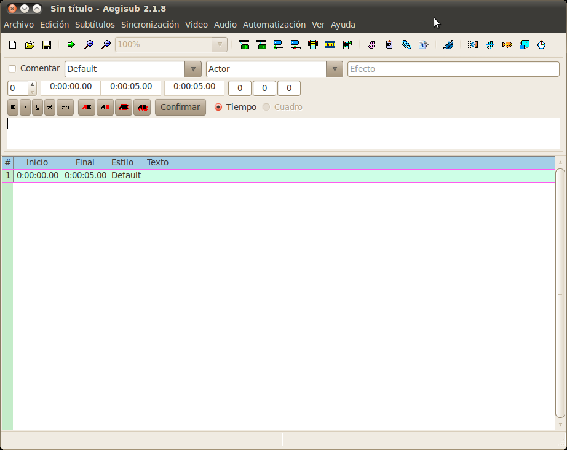
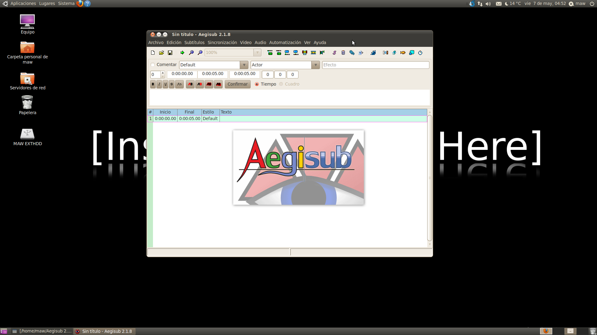

Aegisub es un programa editor de subtítulos no profesional. Es decir, que además de ser un programa para editar subtítulos conforme a tiempos, aquí podremos agregar un sin fin de efectos a nuestros subtítulos, como se nos haga necesario, entre los que se encuentran karaokes e imágenes, aprovechando todo el potencial de Advanced SubStation Alpha (ASS), un formato de códigos para subtítulos más avanzado que el SubStation Alpha (SSA) o el SRT. Este es el programa más usado por los fansubs de anime para realizar el subtitulado, pero hasta hace poco instalarlo en un **sistema GNU/Linux** resultaba toda una odisea, ya que había que compilarlo uno mismo o agregar repositorios de *«dudosa procedencia»* a nuestro sistema; sin embargo, a partir de su versión 2.1.8, **Aegisub oficialmente ha salido para sistemas GNU/Linux**, y aquí veremos cómo instalarlo y poder ejecutarlo sin problemas.

> **Nota**: el tutorial está basado en el entorno Gnome, utilizando el sistema Ubuntu 10.04 Lucid Lynx.

## Descargando Aegisub

Los links de descarga son los siguientes; puedes seleccionar cualquiera dependiendo de la versión de tu distro, o puedes ir a la web oficial de [**Aegisub**](http://www.aegisub.org).

| Descripción | HTTP | FTP | Checksum | Tamaño |
| --- | --- | --- | --- | --- |
| Linux glibc 2.7 x86 | [HTTP](http://ftp.aegisub.org/pub/releases/aegisub-2.1.8-linux-glibc27-x86.tar.bz2) \| [HTTP2](http://ftp2.aegisub.org/pub/releases/aegisub-2.1.8-linux-glibc27-x86.tar.bz2) | [FTP](ftp://ftp.aegisub.org/pub/releases/aegisub-2.1.8-linux-glibc27-x86.tar.bz2) \| [FTP2](ftp://ftp2.aegisub.org/pub/releases/aegisub-2.1.8-linux-glibc27-x86.tar.bz2) | [MD5](http://ftp.aegisub.org/pub/releases/aegisub-2.1.8-linux-glibc27-x86.tar.bz2.md5) \| [SHA](http://ftp2.aegisub.org/pub/releases/aegisub-2.1.8-linux-glibc27-x86.tar.bz2.sha) | 4.7MB |
| Linux glibc 2.7 x86_64 | [HTTP](http://ftp.aegisub.org/pub/releases/aegisub-2.1.8-linux-glibc27-x86_64.tar.bz2) \| [HTTP2](http://ftp2.aegisub.org/pub/releases/aegisub-2.1.8-linux-glibc27-x86_64.tar.bz2) | [FTP](ftp://ftp.aegisub.org/pub/releases/aegisub-2.1.8-linux-glibc27-x86_64.tar.bz2) \| [FTP2](ftp://ftp2.aegisub.org/pub/releases/aegisub-2.1.8-linux-glibc27-x86_64.tar.bz2) | [MD5](http://ftp.aegisub.org/pub/releases/aegisub-2.1.8-linux-glibc27-x86_64.tar.bz2.md5) \| [SHA](http://ftp2.aegisub.org/pub/releases/aegisub-2.1.8-linux-glibc27-x86_64.tar.bz2.sha) | 4.9MB |

## Preparando el programa



Una vez finalizada la descarga tenemos un archivo del tipo **tar.bz2**, del cual extraeremos el contenido utilizando el **gestor de archivadores**, o escribiendo en una terminal lo siguiente:

```bash title="Terminal"
tar jvxf aegisub-2.1.8-linux-glibc27-x86.tar.bz2
```

Una vez que hemos extraído la carpeta **aegisub-2.1.8-linux-glibc27-x86**, es recomendable moverla a la carpeta personal y ocultarla, ya que este será el directorio sobre el cual trabajará Aegisub, y es preferible que no se le realicen modificaciones no deseadas para evitar pérdidas de archivos. Para ocultar la carpeta solo es necesario renombrarla y agregar un punto al inicio, quedando de la siguiente forma: **.aegisub-2.1.8-linux-glibc27-x86**.

## Creando los lanzadores

Primero prepararemos los iconos; para ello escribiremos en una terminal:

```bash title="Terminal"
sudo nautilus
```

Por supuesto, suponiendo que Nautilus sea nuestro navegador de archivos; si no, pues el que nos corresponda.

Nos situamos en **/.aegisub-2.1.8-linux-glibc27-x86/share/icons/hicolor/scalable/apps** y copiamos el archivo **aegisub.svg** en **/usr/share/icons/hicolor/scalable/apps**. Posteriormente vamos a **/.aegisub-2.1.8-linux-glibc27-x86/share/icons/hicolor/48×48/apps** y copiamos el archivo **aegisub.png** en **/usr/share/pixmaps**, y podremos crear nuestro lanzador. Para ello iremos a **Sistema – Preferencias – Menú Principal**:



Nos situamos en el menú/submenú donde queremos añadir el lanzador y damos clic en **Elemento nuevo**; se nos abrirá una ventana para crear el lanzador.



Al llegar a la opción que dice comando, damos clic en examinar y buscamos nuestra carpeta **aegisub-2.1.8-linux-glibc27-x86**. En caso de que no podamos verla, basta con presionar **Ctrl + H** para mostrar todos los archivos ocultos; la abriremos y seleccionaremos el archivo **aegisub-2.1**, damos clic en abrir, y nos habrá puesto en comando la ruta al archivo; damos clic en aceptar y finalmente en cerrar.

Ahora podemos ir a nuestro menú de aplicaciones y encontraremos nuestro lanzador en el sitio que elegimos.



Dando clic sobre el lanzador ya podemos ejecutar Aegisub cuando queramos. Si nuestro Aegisub llegase a abrirse en idioma inglés, podemos cambiarlo a español en el menú **View – Language… – Spanish**; nos pedirá reiniciar la aplicación, lo cual podemos hacer sin ningún inconveniente, y tendremos Aegisub listo para trabajar cuando lo deseemos.




