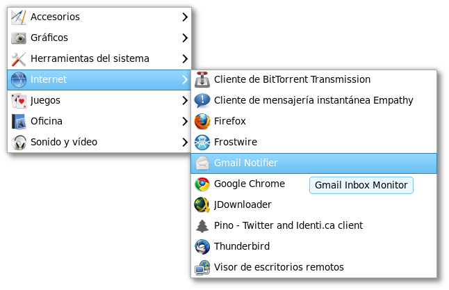
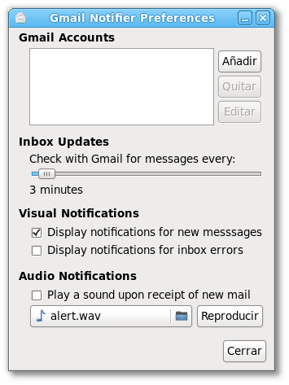
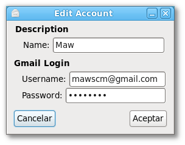
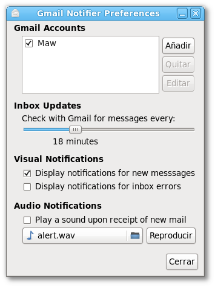
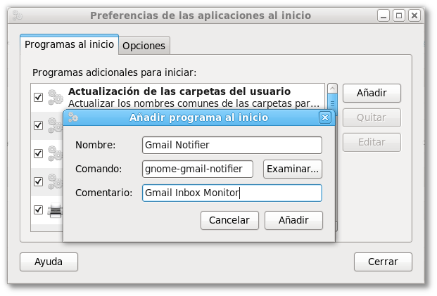
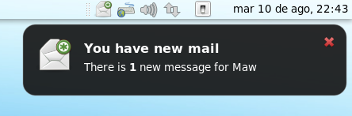

<!-- TODO: imagen original (notifier.png, icono de Gmail Notifier) alojada en Photobucket, que ya no sirve imágenes hotlinkeadas de cuentas gratuitas. Reemplazar si se recupera una copia local. -->

Como su nombre lo indica, el objetivo de [**Gmail Notifier**](https://launchpad.net/gm-notify/) es avisarnos en el momento que recibimos un correo electrónico en nuestra cuenta de [**Gmail**](http://www.gmail.com), la gran ventaja que tiene este programa desarrollado en [**Python**](http://www.python.org/) es que no tenemos que tener el explorador abierto para poder recibir las notificaciones. Se ejecuta en segundo plano, revisa regularmente nuestra cuenta de correo y nos muestra una notificación cada vez que encuentra un nuevo mensaje.

Y, como es de esperarse de programas como estos, tanto su instalación como su configuración son cosas realmente sencillas, y aquí les dejo la forma de hacerlo en Fedora 13.

## Instalación

Instalar Gmail Notifier es tan sencillo como abrir una terminal y escribir lo siguiente:

```bash title="Terminal"
sudo yum -y install gnome-gmail-notifier
```

Si prefieres hacerlo de forma gráfica, solo tienes que dirigirte a **Sistema > Administración > Añadir/Quitar Software** y buscar el paquete correspondiente.

## Configuración

Después de instalar Gmail Notifier tenemos que configurarlo para que pueda acceder a nuestro correo, lo cual también es realmente sencillo.

**1.** Para comenzar, nos dirigimos a **Aplicaciones > Internet > Gmail Notifier**.



**2.** Lo siguiente que verás será el icono de correo electrónico en la barra de notificación.


Haz clic con el botón secundario y selecciona la opción **Preferencias**.

**3.** Una vez que se haya abierto la ventana de preferencias, da clic en el botón **Añadir** para agregar tu cuenta de Gmail.



**4.** Llena los campos correspondientes y da clic en **Aceptar**.



**5.** Ya que hemos añadido una cuenta, activamos la casilla de verificación de la misma para activarla. En el área que dice **Inbox Updates** elegimos cada cuánto tiempo queremos que el programa se conecte a nuestro correo para verificar si hay nuevos mensajes. En **Visual Notifications** nos aseguramos de que la opción **Display notifications for new messages** se encuentre activada y, por último, si lo deseamos, seleccionamos el sonido que reproducirá el programa en caso de que encuentre un mensaje nuevo, y damos clic en cerrar.



Con esto ya tendremos configurado nuestro Gmail Notifier, y este revisará periódicamente nuestra cuenta de correo en busca de nuevos mensajes. Sin embargo, el programa no se ejecutará automáticamente al iniciar sesión, así que es necesario iniciarlo desde el menú **Aplicaciones > Internet > Gmail Notifier**. En caso de que deseemos que el **GN** se ejecute desde que iniciamos sesión, solo tenemos que agregarlo en **Sistema > Preferencias > Aplicaciones al inicio**, dar clic en el botón **Añadir** dentro de la pestaña **Programas al inicio** y agregar los siguientes datos.



Finalmente, damos clic en **Añadir** y, por último, en **Cerrar**. Con esto, el Gmail Notifier quedará configurado y se ejecutará cada vez que iniciemos sesión. Espero que esta entrada les sea de utilidad a todos; si tienen algún problema o alguna duda, no titubeen al momento de escribírmela y haré todo lo posible por ayudarlos. Por último, les dejo una prueba de que el programa funciona correctamente.


