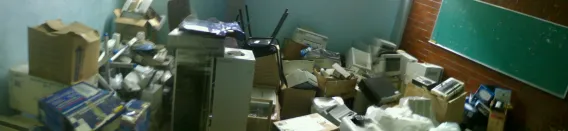
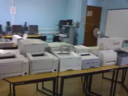
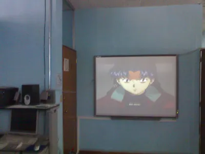

Muchas de las personas que me conocen deben de pensar que mi trabajo es muy sencillo y que cualquiera podría realizarlo, y no voy a negar que en muchos aspectos esto es cierto. Sin embargo, hay momentos que le quitan todo el encanto al trabajo, y hay algunos otros que hacen que valga la pena…

Entre esos aspectos que le quitan el encanto está el hecho de tener que realizar los inventarios de todos los equipos con los que cuenta el centro. Y se preguntarán: bueno, ¿qué tan difícil puede ser copiar unos cuantos números de serie, marcas y modelos? Y la verdad es que eso no es tan complicado. Lo difícil viene cuando te topas con lugares como este, donde hay equipos de cómputo perdidos entre las profundidades…

Sí, esa fotografía que ven es real, y lamentablemente solo es la mitad de la habitación, ya que aún quedan muchas cosas por mostrar. En fin, tengo que ver cuántos equipos hay dentro de este desbarajuste, y cuántos son funcionales. Pero, como dije, no todo es un cruel castigo: hay momentos en los que uno puede encontrar, dentro de este abismo de aparatos, cosas que pueden considerarse verdaderas *reliquias*, como la siguiente impresora **Okidata** de matriz de punto —sí, de esas que se utilizaban hace unas cuantas décadas y que aún se siguen usando en algunas sucursales bancarias, y cuya calidad de impresión es similar a la de un ticket de compra—. Y bueno, creo que no fue la única impresora que encontré; de hecho, encontré 15 en las 2 horas en que estuve acomodando.

Pero también quiero destacar las bondades que tiene mi trabajo, y aunque sean pocas, nunca está de más comentarlas. Una de ellas es el hecho de tener una conexión a internet de 4MB. Sé que a algunos no les parecerá mucho, sobre todo a aquellos que viven en otros países, pero hay que tomar en cuenta que aquí en México la velocidad promedio de conexión es de 1MB, sin contar que hay quienes aún tienen conexión de 512Kb.

Otra ventaja es que, si estás aburrido, siempre puedes —de forma completamente ilegal— encender las computadoras y proyectores de *Enciclomedia* y ponerte a ver tus series de anime o películas favoritas. Por ejemplo, yo estoy viendo *Neon Genesis Evangelion* por enésima vez, esta vez con la diferencia de que mi pantalla supera las 100 pulgadas. Jajaja…

