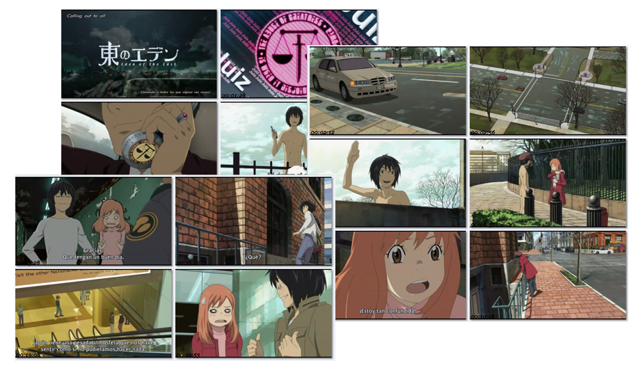

import VideoEmbed from '../../../components/VideoEmbed.astro';

La gran mayoría de producciones anime en los últimos años ha caído en cierto número de conceptos que poco a poco han ido restando calidad a las historias que nos ofrecen. Siendo mucho más específicos, podríamos decir que, de continuar las cosas como van, en un par de años solamente podremos elegir entre "**una historia corta, generalmente mala y llena de fanservice**" o "**una buena historia alargada de tal forma que pierde el sentido**".

Por desgracia, en estos últimos años ha habido pocas historias que realmente podrían pasar a la historia como Grandes Series; si bien en 2006 vivimos un apogeo de series que han pasado a formar parte de esa lista, y algunas de ellas hasta han sido denominadas series de culto, en los últimos años hemos encontrado muy pocas series que revolucionen el anime. Si soy sincero, después de [**Toradora!**](http://www.starchild.co.jp/special/toradora/) no había vuelto a ver una serie completa sin hacer pausas entre episodios (pausas que llegaron a durar días, incluso meses).

Gracias a *Kami-sama* aún existe gente que apuesta por las buenas historias en el número ideal de episodios, así como por conceptos que no se han explotado o lo han sido muy poco, y una de esas series que apuestan por nuevos conceptos es la que volvió a captar mi atención. Se trata de [**Higashi no Eden**](http://juiz.jp/), mejor conocida como *Eden of the East*.

## Un poco de historia

**Eden of the East** (東のエデン, *Higashi no Eden*) es una serie de anime que se estrenó en la cadena televisiva [FUJI TV](http://www.fujitv.co.jp) en el bloque de noitaminA el 9 de abril de 2009. Creada, dirigida y escrita por *Kenji Kamiyama*, el director de [**Ghost in the Shell**](http://www.ghostintheshell.tv/), con la asistencia de *Chika Umino* de [**Honey and Clover**](http://www.hachikuro.net/) en el área de diseño de los personajes, y producida por el estudio [Production I.G](http://www.productionig.com/).

> **Sinopsis:** *La historia se centra en la joven **Saki Morimi**, una estudiante japonesa que se encuentra de vacaciones en Estados Unidos para celebrar su graduación. Por una sucesión de eventos inesperados, termina involucrada con un joven que ha perdido la memoria y responde al nombre encontrado en su pasaporte, **Takizawa Akira**, quien posteriormente procura recuperar su identidad y esclarecer el enigma detrás de su papel como miembro de un grupo de individuos seleccionados (**Seleção**) por una entidad que se hace llamar **Mr. Outside** para ejecutar un plan de acción con el fin de «salvar» a Japón.*

Si bien, después de leer la sinopsis, la serie no parece en un principio realmente prometedora, la serie capta nuestra atención desde el opening, ya que Production I.G. se arriesga (no encontré otra forma de describirlo) con una animación muy distinta a la que nos tienen acostumbrados la mayoría de los animes, y acierta dándole un toque más de novedad al no utilizar un tema en japonés; y no solo eso, sino un tema interpretado por un grupo que ni siquiera pertenece al archipiélago nipón.

Se trata del tema **Falling Down** de la banda británica **Oasis**, tema que, sin duda, junto con la animación del opening, nos demuestra que no se trata de una serie más.

<VideoEmbed platform="youtube" id="lwLsw9MlzJQ" title="Opening de Eden of the East — Falling Down, de Oasis" />

Después, poco a poco y conforme van avanzando los episodios, la historia nos va adentrando en un sin fin de enigmas, y el hecho de que ninguno de los personajes pueda conocer la respuesta, así como el intento de todos los Seleção por ganar el juego de ser el salvador de Japón, agregan un tinte de misterio que está muy bien compensado con algo de romance y humor. Sin duda, una serie muy buena.

La serie consta de 11 episodios, siendo el último más que un episodio final un vínculo a la primera película **Higashi no Eden: Gekijouban I The King of Eden**, la cual continúa la historia justo donde quedó y nos deja en suspenso para que veamos la recién estrenada (en Japón, obviamente) segunda y última película: **Higashi no Eden: Gekijouban II Paradise Lost**. En resumen, es una excelente serie que no podemos perdernos.
