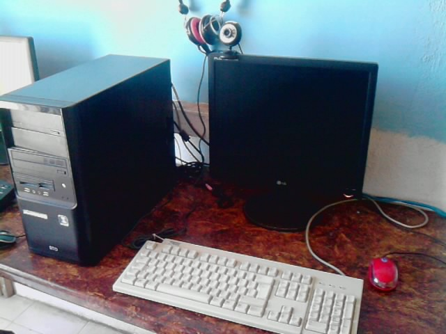
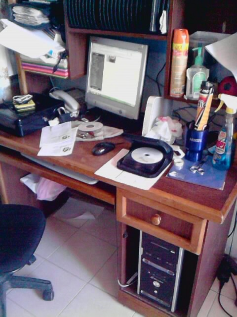
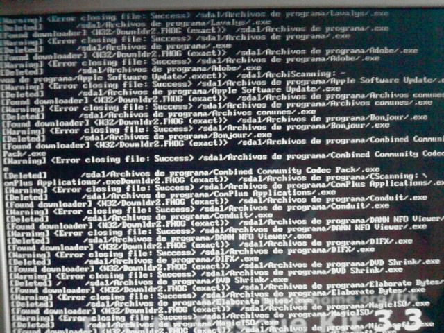

Hace un par de días salí de la bella Ciudad de México hacia la ciudad de Aguascalientes, a unos 600 km al noroeste. Han de saber que gran parte de mi familia vive en dicha ciudad, por lo que suelo aceptar trabajos que valgan la pena el viaje hasta allá, y en esta ocasión salí con una misión no muy clara, incluso podría determinarla como desconocida.

En fin, la misión que acepté consistía en resucitar un pequeño cyber café, negocio de un compañero de trabajo de uno de mis tíos, así que al llegar, y después de instalarme en casa de mi tía, me dirigí hacia el cyber en cuestión.

## El cyber

Aquí les pongo los datos más relevantes con los que cuenta el cyber:

**5 PCs habilitadas como terminales de usuario:** *procesador Intel Atom a 1.60 GHz, 512 MB en RAM, 80 GB en disco duro y sistema operativo Windows UE7.*

**1 PC habilitada como servidor de control del cyber:** *procesador Intel Core2 Duo a 2.40 GHz, 2 GB en RAM, 250 GB en disco duro y sistema operativo Windows UE7.*

## El problema

Después de una breve charla, el encargado del cyber me explica que todas las PC —incluyendo el servidor— últimamente han tenido diversos problemas; el más común de todos es el hecho de que se abre continuamente el explorador mostrando una página de *Metroflog*, cosa que tanto a él como a los usuarios está volviendo locos. Entre otros problemas aislados.

## Su solución

Debido a estos problemas, el dueño quiere aprovechar y actualizar por completo el sistema operativo e instalar **Windows 7** en todas las máquinas, ya que con esto —según él— no volverá a tener estos problemas.

## Mi solución

Le informo a mi cliente que su problema, si bien pudo haber sido un factor, no depende de la versión que tenga de Windows, sino de la mala configuración y la falta de un buen antivirus. Así que, para ahorrarle dinero y disgustos, propongo que se haga el vacunado completo de todas las máquinas e instalación de antivirus.

## Comienza la misión

Mi cliente —confiado en que él sabe mejor que yo de lo que habla, puesto que él tiene varios años en ese negocio— insiste en que la solución es instalar Windows 7. Y como me enseñaron en mi casa: **«Al cliente, lo que pida».**

Inicié el formateo e instalación en una de las terminales, ya que querían continuar ofreciendo el servicio y, como era de esperarse, no planeaban facilitarme mucho las cosas. Me sorprendió cómo la máquina, a pesar de sus deficiencias, no mostró ningún problema durante la instalación y todo concluyó sin dificultades; pero al momento de exigirle que trabajara Internet y Word al mismo tiempo, comenzó a mostrar la realidad, y el trabajo se ralentizó a más no poder. Aproveché la oportunidad para mostrarle al cliente que no era la mejor opción instalar Windows 7, al menos en las terminales; al fin desistió y me pidió que le instalara el Windows que yo creyera más conveniente.

Ya que no cerraron el lugar para que pudiera trabajar, decidí esperar hasta que cerraran y trabajar toda la noche si era necesario, con tal de que el servicio no se viera interrumpido ni un solo día. Al restaurar las terminales no hubo ningún problema, puesto que todo tendría que borrarse; la odisea llegó al momento de restaurar el servidor.

## Un virus de proporción bíblica

Para restaurar el servidor era necesario primero respaldar la información con la que contaba; el problema era hacerlo sin respaldar también el virus, así que recurrí a mi disco de **Trinity Rescue Kit** y comencé a buscar el virus, y grande fue mi sorpresa cuando en el monitor comencé a recibir las siguientes alertas de virus:

El virus se había clonado en todas y cada una de las carpetas, así que, después de una hora de continuos mensajes como los anteriores, por fin pude respaldar los archivos; después de eso, todo salió muy bien.

## Final ¿feliz?

Una vez restauradas todas las máquinas, configuré la red, y aunque tuve unos problemillas para compartir la impresora y con el audio de una terminal, no pasó a mayores.
