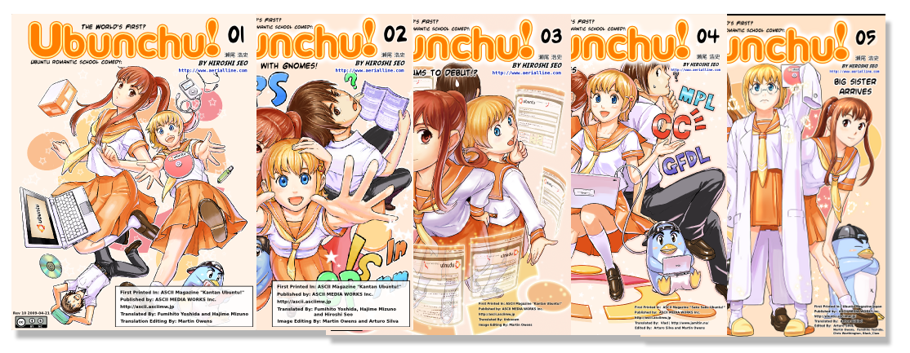

Como linuxero, otaku y friki en general, no podía dejar de hablar sobre este tema. Aunque ya tiene rato que me enteré de la existencia de este manga sobre las bondades de Linux, con un enfoque especial en una de las distros más famosas y a la vez más accesibles para el nuevo usuario: Ubuntu. Así que primero vamos a responder un par de preguntitas...

**¿Qué es Ubunchu?**

«Ubunchu!» es una serie manga japonesa que trata sobre la distribución Linux Ubuntu. Trata sobre unos estudiantes que participan en el club de administración de sistemas y comienzan a adentrarse en Ubuntu. Esta serie es una creación de [**Hiroshi Seo**](http://www.aerialline.com/) y fue publicada originalmente en japonés por [**ASCII MEDIA WORKS**](http://asciimw.jp/) (EF – A fairy tale of the two, Kanon, Angel Beats). Este manga se encuentra bajo la licencia [**Creative Commons: Attribution-NonCommercial 3.0**](http://creativecommons.org/licenses/by-nc/3.0/), la cual permite a cualquiera copiar, distribuir y modificar libremente el trabajo; gracias a esta licencia es que se han creado innumerables traducciones y adaptaciones de este manga.

**¿Qué es Ubuntu?**

> *[**Ubuntu**](http://www.ubuntu.com/) es una distribución Linux basada en Debian GNU/Linux que proporciona un sistema operativo actualizado y estable para el usuario medio, con un fuerte enfoque en la facilidad de uso y de instalación del sistema.*

Tanto el diseño del manga como la historia no son nada del otro mundo; sin embargo, es curioso cómo incluso dentro del mundo del manga hay un espacio para los sistemas GNU/Linux, específicamente Ubuntu en este caso. Otra cosa que me llamó la atención es el hecho de que el autor comparte los archivos fuente para facilitar la traducción del mismo a varios idiomas.

Actualmente este curioso manga cuenta con 5 capítulos (el último fue lanzado en febrero de este año, y se esperan por lo menos otros 2), de los cuales ya se encuentran los 3 primeros en español. De igual forma, ha crecido una pequeña comunidad de fans de esta serie, y como era de esperarse los [wallpapers](http://divajutta.com/doctormo/ubunchu/walls.html) alusivos a la misma no tardaron en salir; puedes encontrarlos, así como los capítulos traducidos, en el [sitio oficial de Ubunchu!](http://ubunchu.net)

**Maw opina:** Si bien no he leído los 5 capítulos con los que ya cuenta el manga, realmente la historia es entretenida y se centra en una característica de los sistemas Linux por capítulo (software libre, uso de terminal, etc.), y a diferencia de lo que podría pensarse, los personajes no son fanboys de Ubuntu, sino que son tres «simples» estudiantes que tienen, cada uno, su SO favorito (Windows, Mac, Linux). La única crítica que podría tener al respecto es que la historia es demasiado corta (11 páginas aprox. por capítulo) y, por lo tanto, resulta un poco forzada y predecible, pero vamos, que eso le podría pasar a cualquiera con tan pocas viñetas.
