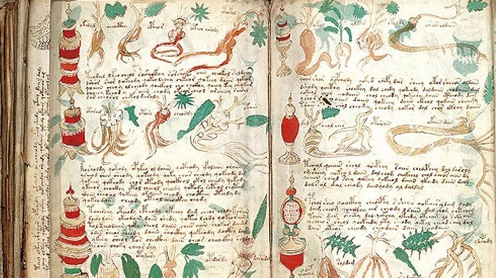

Imaginate que pasas poco más de un siglo tratando de entender un libro que ha desconcertado a criptógrafos, lingüistas, historiadores y curiosos, bueno pues eso mismo es lo que ha pasado con el **Manuscrito (algunos le llaman códice) Voynich**. Este enigmático códice ilustrado, escrito en un idioma desconocido y plagado de dibujos de plantas imposibles, figuras femeninas y diagramas astrológicos, ha sido descrito como _“el libro que nadie puede leer”_. Pero, ¿y si llevamos siglos buscando la respuesta equivocada? ¿Y si el manuscrito nunca fue pensado para ser entendido por nadie más que su autor?

Encontrado por el anticuario Wilfrid Voynich en 1912, el manuscrito ha sido datado mediante pruebas de carbono entre 1404 y 1438. Su escritura no se parece a ningún sistema conocido, y sus ilustraciones parecen una mezcla entre lo botánico, lo alquímico y lo onírico. Las teorías abundan: algunos dicen que es un texto cifrado, otros que es una broma elaborada, incluso hay quienes proponen orígenes alienígenas o lenguas perdidas.

Sin embargo, ninguna teoría ha logrado descifrarlo de manera convincente. Todos parten del mismo supuesto: que el manuscrito está intentando comunicarse con un lector externo.

## Una hipótesis distinta: un proyecto personal, privado

Imaginemos por un momento otra posibilidad. ¿Y si el autor nunca pensó en lectores externos? ¿Y si el Voynich es simplemente un cuaderno de apuntes, un diario mental, una libreta de ideas o desvaríos hecha por alguien que tenía los conocimientos, recursos, tiempo libre y una pulsión creativa interna?

Este enfoque no busca forzar una traducción. Busca comprender la motivación humana detrás del acto de escribir algo que solo uno mismo puede entender.

Hay algunos detalles que sugieren esta hipótesis:

1. **Escritura fluida y sin correcciones:** El manuscrito está escrito con una caligrafía consistente, sin apenas tachaduras o errores. Eso no es común en borradores, pero sí en textos donde el autor domina lo que está escribiendo… incluso si ese sistema de signos es inventado.

3. **Plantas que no existen, pero quizás fueron descritas:** Muchas de las ilustraciones botánicas parecen una mezcla de rasgos reales con otros puramente imaginarios. ¿Y si el autor nunca vio esas plantas? ¿Y si se basó en descripciones verbales, como ocurría con los bestiarios medievales donde hipopótamos parecían peces con patas y colmillos?

5. **Diagramas astrológicos con anotaciones mínimas**: Algunas páginas incluyen diagramas circulares que parecen tener relación con el zodíaco. Sin embargo, sus marcas no siguen convenciones claras. Es posible que funcionaran como disparadores mentales para el autor, como un calendario o recordatorio personalizado.

7. **Influencias gráficas mezcladas:** Quienes han estudiado el manuscrito han notado que algunos caracteres recuerdan a letras del sánscrito, el hebreo, el árabe o el latín, pero sin seguir reglas conocidas. Esta mezcla podría deberse a una apropiación estética, no lingüística. Muchos adolescentes —y también adultos creativos— inventan sistemas propios tomando formas de diferentes alfabetos.

## ¿Y si no quería que lo leyeran por qué lo encuaderno?

Vale, acepto que, una encuadernación tan profesional no es algo común para "notas personales", después de todo ¿por qué alguien invertiría en pergamino e ilustraciones si no iba a compartir su obra? Aquí es donde otra posibilidad aparece: el autor quizás nunca lo encuadernó.

Es posible que alguien cercano —un amigo o familiar— encontrara las hojas sueltas y decidiera preservarlas como homenaje póstumo.

Eso explicaría:

- El orden inconsistente de las secciones.

- La mezcla de temas sin conexión evidente.

- La falta de correcciones _(¿quién corrige notas que no piensa mostrar?)_.

## El verdadero misterio: el autor

En lugar de centrarnos obsesivamente en lo que el manuscrito “dice”, esta perspectiva propone algo distinto: miremos al autor. Alguien que vivió hace más de quinientos años, que tenía tiempo, materiales, y una mente inquieta. Que no buscaba fama ni lectores, sino simplemente explorar su propio pensamiento.

Este manuscrito pudo ser su jardín secreto. Su espacio simbólico. Su diario mental. Y eso no lo hace menos valioso, sino quizás aún más fascinante.

Si alguna vez escribiste en un cuaderno con símbolos que solo tú entendías, si garabateaste alfabetos inventados o creaste mundos internos sin necesidad de mostrarlos… entonces sabes exactamente de lo que hablo. Tal vez el autor del Manuscrito Voynich no era un genio ocultista ni un criptógrafo: tal vez solo era una persona normal.
